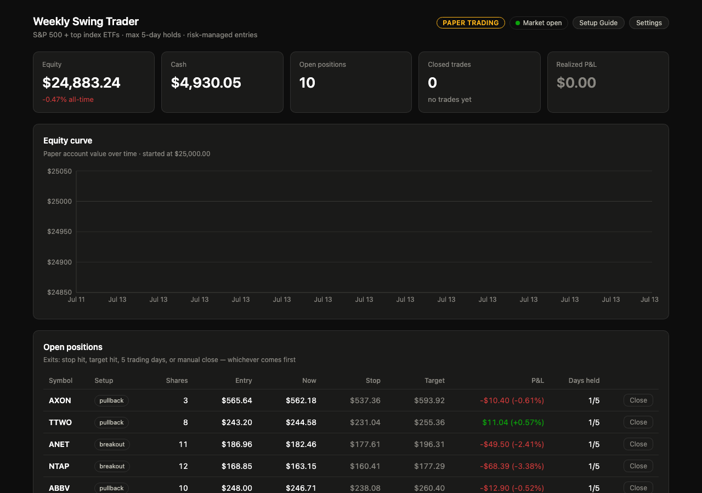

# Weekly Swing Trader

An automated weekly-swing trading system with a React dashboard, AI-powered
news analysis, and optional live execution via the Robinhood MCP (Model Context
Protocol). Scans the S&P 500 plus ~110 top ETFs, opens risk-managed positions
with a hard 5-trading-day max hold, and shows everything on a real-time dashboard.

Built for paper trading first — a toggle in the UI (behind two confirmation dialogs)
switches to live trading once the Robinhood MCP is connected.



---

## Quick Start

```bash
# 1. Clone the repo
git clone https://github.com/<your-username>/Robinhoodmcptrader.git
cd Robinhoodmcptrader

# 2. Set up the Python backend
cd backend
python3 -m venv venv
source venv/bin/activate    # Windows: venv\Scripts\activate
pip install -r requirements.txt

# 3. Configure your AWS Bedrock keys (for AI analysis)
cp config.example.py config.py
# Edit config.py with your AWS credentials, or configure them later via the dashboard Settings button.

# 4. Build the React dashboard
cd ../dashboard
npm install
npm run build

# 5. Start the server
cd ..
./start.sh                  # or: cd backend && ./venv/bin/uvicorn main:app --host 127.0.0.1 --port 8000

# 6. Open the dashboard
open http://127.0.0.1:8000
```

The server runs unattended: it idles off-hours and scans/trades during US market
hours (9:30–16:00 ET, Mon–Fri). State persists to JSON files, so restarts lose
nothing.

### macOS desktop apps (optional)

If you're on macOS, create clickable launcher apps:

```bash
osacompile -o ~/Desktop/"Swing Trader.app" -e 'do shell script "/path/to/Robinhoodmcptrader/launch.sh"'
osacompile -o ~/Desktop/"Stop Swing Trader.app" -e 'do shell script "/path/to/Robinhoodmcptrader/stop.sh"'
```

---

## Trading Strategy

The strategy scans the S&P 500 plus ~110 large ETFs every 10 minutes during
market hours, looking for stocks in established uptrends (price above the 50-day
average with positive 12-week momentum) that are either pulling back sharply in
the short term or breaking out near their 20-day high on expanding volume.

### Universe rules

- **S&P 500 constituents** — refreshed weekly from Wikipedia (always current membership)
- **~110 curated ETFs** — broad index, sector, bond, commodity (largest/most liquid)
- **No penny stocks** — minimum $5 price, minimum $10M/day dollar volume
- **No meme stocks** — explicit denylist (GME, AMC, etc.)
- **No leveraged/inverse ETFs** — only straightforward products

### Entry conditions

Two setups, both requiring an established uptrend:

1. **Pullback** — RSI-2 below 15 (last 2 days oversold) inside a strong uptrend with
   12-week momentum > +5%. Buys a short-term discount in something already working.
2. **Breakout** — close within 2% of the 20-day high, with 5-day volume above the
   20-day average and positive 1-month momentum. Fresh highs on expanding volume.

### Market regime filter

No new positions when SPY is below its 50-day moving average. The system sits in
cash when the broad market is weak — most weekly-swing losses happen when the
whole market is falling.

### Risk management

- **Stop loss**: 1.5× ATR below entry, clamped to 2–5% maximum
- **Take profit**: +5% or 1.6× the stop distance — whichever is smaller
- **Time exit**: any position still open after 5 trading days is closed at market
- **Position sizing**: risks 1% of equity per trade, max 10% per position
- **Max concurrent positions**: 10
- **Whole shares only**: no fractional share positions

### Ranking

Candidates are scored by a composite of 12-week momentum, relative strength vs
SPY over the last month, and setup-specific quality (oversold depth for pullbacks,
volume expansion for breakouts). The top 15 are shown on the dashboard; the trader
fills open slots from the top.

---

## AI Integration (Claude on AWS Bedrock)

After each quantitative scan, **Claude Opus 4.8** (via Amazon Bedrock) reviews the
top candidates with their last-48-hour news headlines and issues a verdict:

| Verdict | Meaning | Effect |
|---|---|---|
| **Endorse** | News supports the setup (positive catalyst, no risks) | Small score boost, ranks first |
| **Neutral** | Nothing material either way | No change |
| **Veto** | Concrete risk price data can't see (imminent earnings, lawsuit, guidance cut) | Excluded from trading |

The AI is deliberately non-intrusive:
- It can only veto/endorse from the scanner's list — it never introduces its own tickers
- All risk limits stay intact regardless of AI verdicts
- If Bedrock or news fetching fails, the scan proceeds unreviewed (fail-open)
- The review is batched (one API call per cycle, not per ticker)
- Verdicts are cached for 30 minutes when the candidate list is unchanged

The dashboard shows: an "AI Market Read" note at the top, a colored verdict chip on
each recommendation card, the AI's one-sentence reasoning, and expandable recent
headlines per ticker.

### Cost

Claude Opus 4.8 at ~$0.10–0.15 per review × one review every 10–30 minutes during
market hours ≈ **$2–5 per trading day**.

---

## Deterministic Logic (Python Backend)

The system runs on a fully deterministic quantitative core — every entry, exit, and
sizing decision is computed from price data with fixed, auditable rules:

```
backend/
  universe.py       S&P 500 scrape + curated ETF list (cached 7 days)
  strategy.py       Technical indicator engine + candidate scanner
  paper_trader.py   Portfolio simulator: sizing, stops, targets, time exits
  ai_analyst.py     Claude review layer (endorse/neutral/veto per candidate)
  news.py           Last-48h headlines per ticker (Yahoo Finance)
  main.py           FastAPI server + background scheduler (scan → AI → trade)
  config.py         AWS credentials (gitignored — copy from config.example.py)
  state/            JSON persistence (portfolio, scans) — gitignored, survives restarts
```

Key design decisions:
- **No black-box ML**: indicators are textbook (RSI, ATR, SMA, volume ratios) — you
  can read every line and know exactly why a trade was taken
- **AI is advisory, not authoritative**: the AI cannot override sizing, cannot move
  stops, cannot change the universe — it can only block a candidate
- **Fail-open**: any error in the AI/news layer is logged and the strategy continues
  operating on its quantitative edge alone
- **Stateless restarts**: all state is JSON on disk; kill and restart anytime

---

## Connecting Robinhood (Live Trading)

The app is ready for the **Robinhood Trading MCP** — the UI includes a full Setup Guide
and a two-step Paper→Live toggle. Live execution is not yet wired in code (the swap
point is `paper_trader.py`), but the account structure is ready.

### Setup steps

1. Connect the MCP in your AI platform using: `https://agent.robinhood.com/mcp/trading`
2. Complete the Robinhood Agentic account onboarding (prompted after connecting)
3. In the dashboard, click **Setup Guide** for platform-specific instructions
4. Toggle to **Live Trading** (requires two confirmation dialogs for safety)

### Supported platforms

Claude Code, Claude Desktop, ChatGPT, Codex, Cursor, Grok, and any platform
supporting MCP connections.

---

## Dashboard Features

- **Stat tiles**: equity, cash, open positions, closed trades, realized P&L
- **Equity curve**: line chart tracking account value over time
- **Open positions table**: entry/current/stop/target, unrealized P&L, days held,
  manual Close button per position
- **AI-reviewed recommendations**: scored/ranked cards with verdict chips, reasoning,
  expandable news headlines
- **Trade history**: closed trades with exit reason and P&L
- **Paper/Live toggle**: two-dialog confirmation to switch to real money
- **Settings**: configure AWS Bedrock keys from the UI
- **Setup Guide**: complete Robinhood MCP connection instructions

---

## Configuration

| Setting | Where | Default |
|---|---|---|
| AWS Bedrock keys | `backend/config.py` or dashboard Settings | — (required for AI) |
| Scan interval | `SCAN_INTERVAL` in `backend/main.py` | 10 minutes |
| Position check interval | `MANAGE_INTERVAL` in `backend/main.py` | 5 minutes |
| Max positions | `MAX_POSITIONS` in `backend/paper_trader.py` | 10 |
| Risk per trade | `RISK_PER_TRADE` in `backend/paper_trader.py` | 1% of equity |
| Max position size | `MAX_POSITION_PCT` in `backend/paper_trader.py` | 10% of equity |
| Stop cap | `STOP_PCT_CAP` in `backend/strategy.py` | 5% |
| Take profit cap | `TARGET_PCT_CAP` in `backend/strategy.py` | 5% |
| Max hold days | `MAX_HOLD_DAYS` in `backend/strategy.py` | 5 trading days |
| Starting cash | `STARTING_CASH` in `backend/paper_trader.py` | $25,000 |

---

## API Endpoints

| Method | Path | Description |
|---|---|---|
| GET | `/api/status` | Engine status, market hours, last scan time |
| GET | `/api/portfolio` | Cash, equity, positions, trades, stats, equity curve |
| GET | `/api/scan` | Latest scan recommendations with AI verdicts |
| POST | `/api/scan/run` | Force a scan now |
| POST | `/api/positions/{id}/close` | Manually close a position |
| GET | `/api/mode` | Current trading mode (paper/live) |
| POST | `/api/mode` | Switch trading mode |
| POST | `/api/settings/keys` | Update AWS Bedrock credentials |
| POST | `/api/reset` | Reset the portfolio to starting cash |
| GET | `/api/universe` | Current stock + ETF universe |

---

## Data Sources

| Data | Source | Latency | Cost |
|---|---|---|---|
| Historical daily bars (6mo) | Yahoo Finance via `yfinance` | End-of-day | Free |
| Intraday price checks | Yahoo Finance 1-min bars | ~15 min delayed | Free |
| News headlines | Yahoo Finance Ticker.news | Near real-time | Free |
| AI analysis | Claude Opus 4.8 via AWS Bedrock | ~10–30s per review | ~$2–5/day |

**Note on price latency**: Yahoo Finance quotes for NYSE/Nasdaq are approximately
15 minutes delayed. For a strategy holding positions for days with 2–5% stops, this
lag is mostly noise. When live trading via Robinhood MCP, the system should be
upgraded to use Robinhood's real-time quotes.

---

## Disclaimer

**This software is provided for educational and informational purposes only. It is
not financial advice, and no guarantee of profit is made or implied.**

- You are solely responsible for any trades placed by this system, whether in paper
  or live mode.
- Past performance (including paper trading results) does not guarantee future results.
- The strategy targets 1–2% weekly returns, which is 65–180% annualized — an
  aggressive target that carries meaningful risk of loss.
- AI analysis (Claude) may produce incorrect assessments. The system is designed to
  fail safely (proceed without AI on errors), but no system is infallible.
- Market data from Yahoo Finance may be delayed, incomplete, or incorrect.
- The authors are not registered investment advisors, broker-dealers, or financial
  planners.
- By using this software you acknowledge that you understand the risks of automated
  trading and accept full responsibility for any financial outcomes.
- **Never trade with money you cannot afford to lose.**

If you connect the Robinhood MCP for live trading, review Robinhood's own
[Agentic Trading disclosures](https://robinhood.com) for additional risks specific
to AI-directed order execution.

---

## License

MIT
